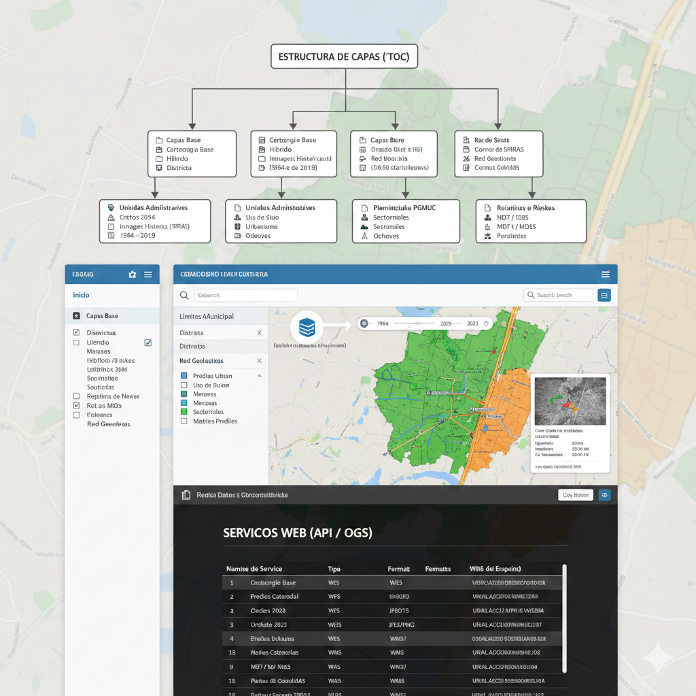
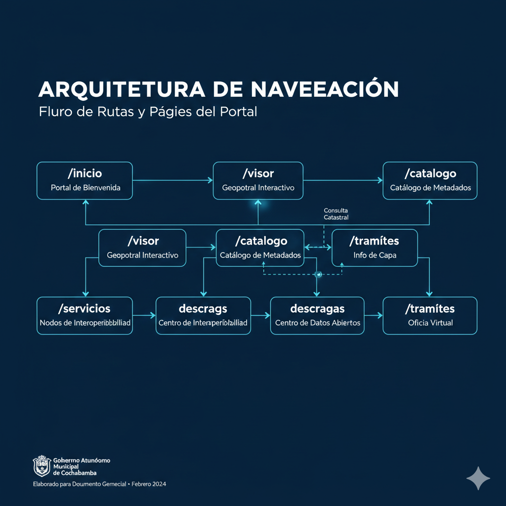
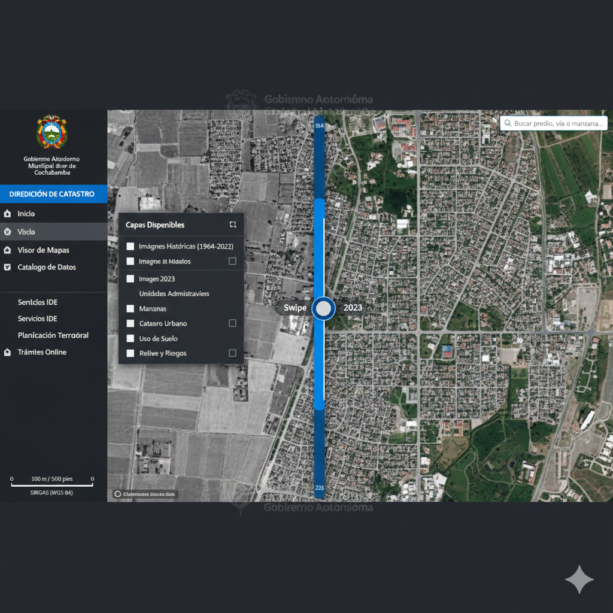
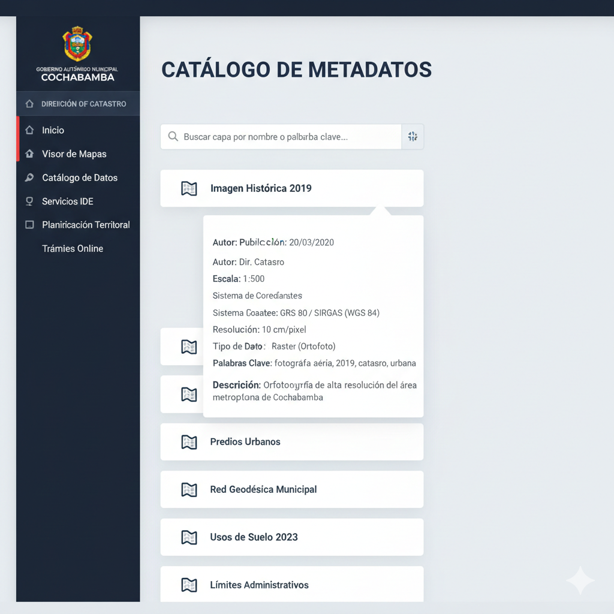
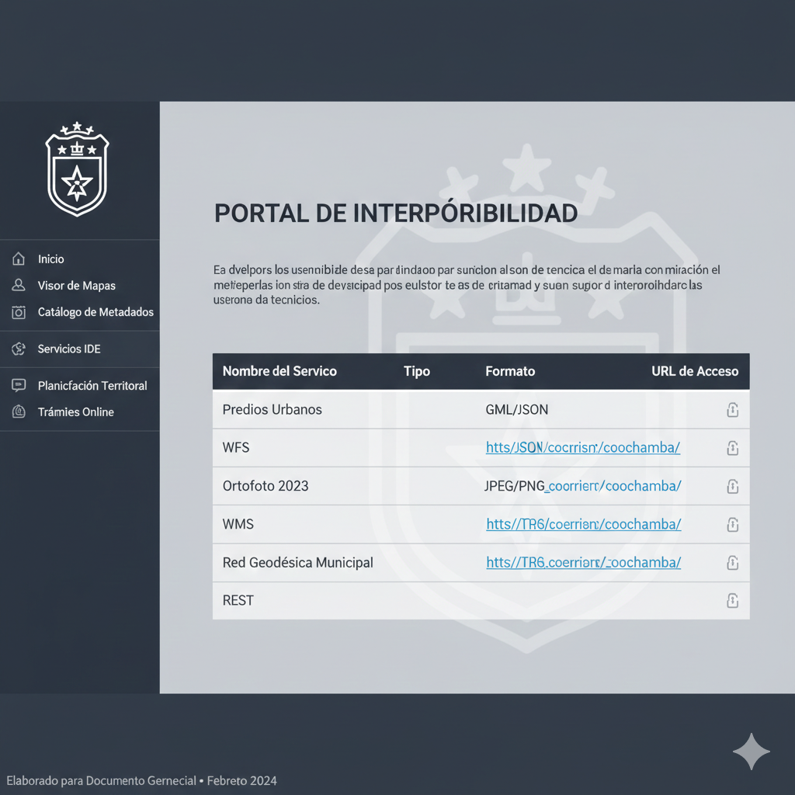
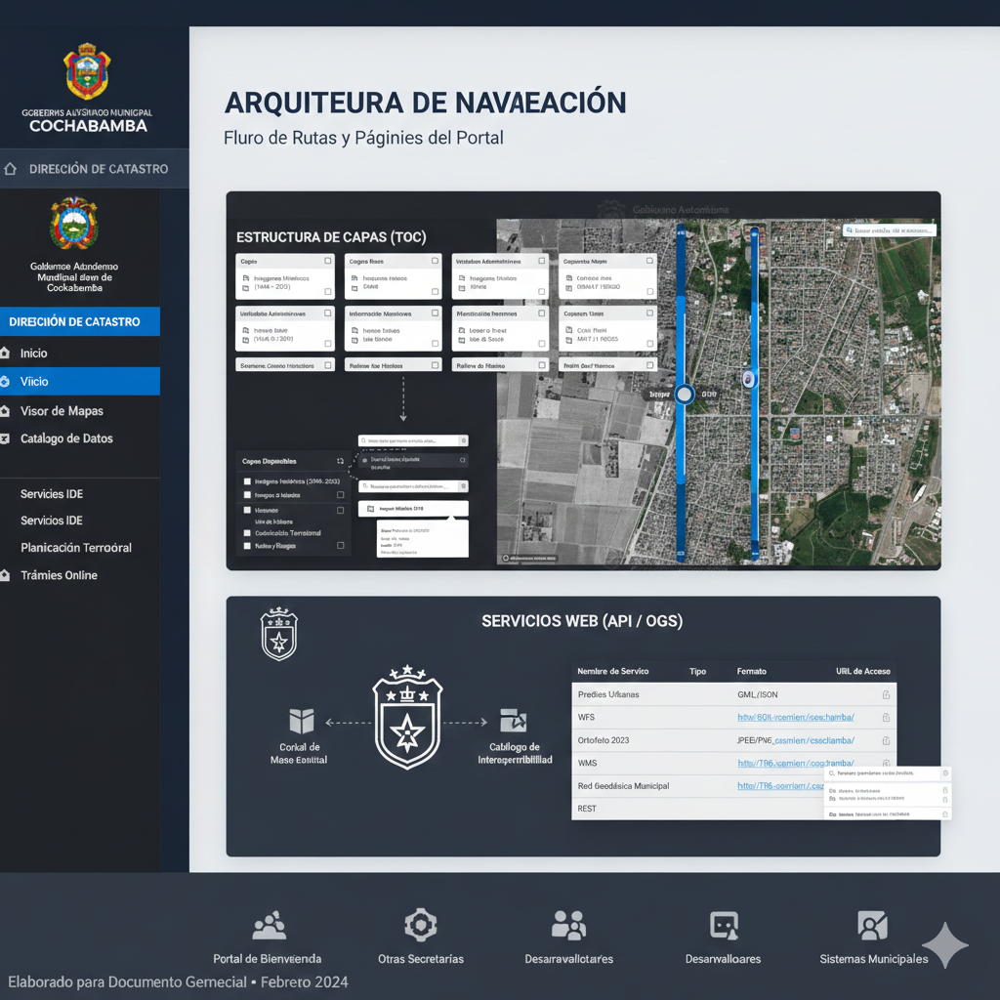
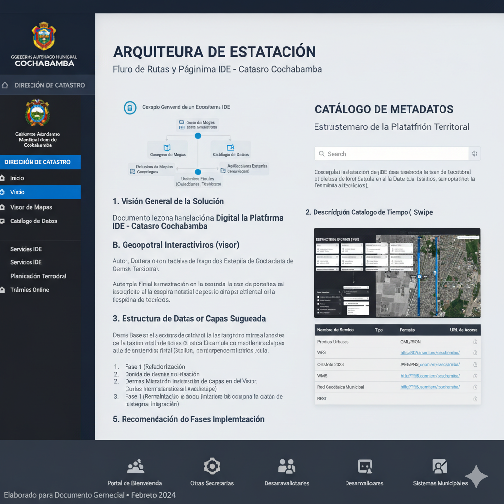

Documento de Estrategia: Estructura de la Plataforma IDE - Catastro Cochabamba
1. Visión General de la Solución
La plataforma no debe concebirse como una página web, sino como un Ecosistema Digital de Gestión Territorial. Siguiendo los estándares de la IDEE (España) y ICDE (Colombia), la estructura se divide en tres niveles: el front-end ciudadano, el back-end administrativo y el motor de interoperabilidad.

Conceptualización de un Ecosistema IDE: Muestra un diagrama de flujo simplificado donde el "Geoportal" es la interfaz, conectada a un "Servidor de Mapas" y una "Base de Datos Geográfica", con flechas saliendo hacia "Aplicaciones Externas" (otras secretarías, desarrolladores) y "Usuarios Finales" (ciudadanos, técnicos).

2. Arquitectura de Navegación (Sitemap y Rutas)
Para garantizar la escalabilidad y una experiencia de usuario profesional, se propone la siguiente estructura de rutas y páginas:

Ruta (URL)	Página	Propósito Gerencial
/inicio	Portal de Bienvenida	Punto de entrada, noticias y estadísticas clave de la Dirección.
/visor	Geoportal Interactivo	Herramienta técnica principal de consulta y análisis espacial.
/catalogo	Catálogo de Metadatos	Inventario legal y técnico de la información (ISO 19115).
/servicios	Nodos de Interoperabilidad	Acceso para desarrolladores y otras secretarías (WMS/WFS).
/descargas	Centro de Datos Abiertos	Transferencia de archivos vectoriales y raster (bajo permisos).
/tramites	Oficina Virtual	Vinculación del mapa con el sistema de trámites de catastro.
Diagrama de Flujo de Navegación del Geoportal: Muestra un diagrama de sitemap con las rutas mencionadas y flechas que indican el flujo entre ellas, por ejemplo, "Inicio" lleva a "Visor", "Catálogo", etc.

3. Descripción Detallada de Páginas Clave
A. Geoportal Interactivo (/visor)
Es la herramienta más crítica. Debe integrar el código que ya posee la Dirección pero migrado a una arquitectura moderna.

Información: Capas de predios, manzanas, distritos, límites municipales, usos de suelo y la serie histórica de imágenes (1964-2019).

Funcionalidades:

Herramienta de Tiempo: Slider para ver la mancha urbana de Cochabamba en diferentes décadas.

Identificador Predial: Al hacer clic en un predio, desplegar atributos (CodCat, superficie, zona tributaria) sin revelar datos personales sensibles.

Filtros Avanzados: Por Comuna, Distrito o rango de fechas de registro.

Ejemplo de Visor con Herramienta de Tiempo (Swipe): Muestra una captura de pantalla de un visor de mapas con dos imágenes superpuestas (ej. una de 1964 y otra actual) separadas por una línea vertical que el usuario puede arrastrar para comparar el cambio territorial.

B. Catálogo de Metadatos (/catalogo)
Es el respaldo legal de la información.

Información: Fichas técnicas de cada capa. Por ejemplo, la metodología de vuelo de la imagen 2019, precisión de los puntos de la Red Geodésica, y fechas de última actualización.

Importancia: Evita el uso indebido de datos y asegura que los técnicos sepan qué tan confiable es un mapa antes de tomar decisiones legales.

Interfaz de Catálogo de Metadatos: Muestra una interfaz de usuario limpia con una lista de capas y un campo de búsqueda, donde al hacer clic en una capa, se expande para mostrar detalles como "Autor", "Fecha de Publicación", "Resolución", "Proyección", "Palabras Clave", etc.

C. Portal de Interoperabilidad y Servicios (/servicios)
Aquí es donde el Catastro se convierte en el "Corazón" de la Alcaldía.

Información: Listado de URLs de servicios web geográficos (ArcGIS REST, OGC WMS).

Uso: Permite que la Secretaría de Infraestructura o de Planificación conecten sus mapas al servidor central de Catastro en tiempo real, evitando duplicidad de datos.

Listado de Servicios OGC/REST: Muestra una tabla con columnas como "Nombre del Servicio", "Tipo (WMS, WFS, ArcGIS REST)", y "URL de Acceso".

4. Estructura de Datos y Capas Sugerida
Para la organización del panel de capas (TOC) en el visor, se recomienda la siguiente jerarquía:

Capa Base (Base Maps): Cartografía base, híbrido, y el histórico de imágenes (17 capas raster).

Unidades Administrativas: Límites municipales, comunas, distritos y subdistritos.

Información Catastral: Manzanas, predios, registros catastrales y matrices de predios.

Planificación y Normativa: Uso de suelo, sectoriales, vías y ochaves.

Relieve y Riesgos: Curvas de nivel, Modelo Digital de Elevación (MDT/MDS) y pendientes.

Redes Geodésicas: Puntos de control GRS 80 - SIRGAS.

Organización Jerárquica de Capas en el Visor: Muestra un panel de capas organizado en categorías colapsables, similar a un árbol, con checkboxes para activar/desactivar cada capa.

5. Recomendación de Implementación
Para asegurar el éxito del proyecto en la Dirección de Catastro, se sugiere un despliegue en tres fases:

Fase 1 (Refactorización): Migrar el código actual a una versión estable de la API de ArcGIS (4.x) para garantizar compatibilidad con dispositivos móviles.

Fase 2 (Normalización): Implementar el Catálogo de Metadatos para formalizar la propiedad de los datos municipales.

Fase 3 (Integración): Conectar el geoportal con la base de datos de recaudaciones o trámites para que el ciudadano pueda consultar el estado de sus procesos geográficamente.

Diagrama de Fases de Implementación: Muestra un diagrama de Gantt simplificado o un gráfico de tres etapas secuenciales: "Fase 1: Refactorización", "Fase 2: Normalización", "Fase 3: Integración", con descripciones breves de cada una.

## 6. Referencias y Geoportales de Clase Mundial

Para el diseño de esta propuesta se han analizado los siguientes referentes globales, los cuales sirven como estándar de éxito:

* **Suiza - swisstopo:** [map.geo.admin.ch](https://map.geo.admin.ch/)
    * *Referente en:* Herramientas de línea de tiempo y comparación histórica.
* **España - IDEE (Infraestructura de Datos Espaciales de España):** [www.idee.es](https://www.idee.es/)
    * *Referente en:* Interoperabilidad, servicios web y estándares europeos.
* **Colombia - ICDE (Infraestructura Colombiana de Datos Espaciales):** [www.icde.gov.co](https://www.icde.gov.co/)
    * *Referente en:* Gestión de Catastro Multipropósito y políticas de datos abiertos.
* **Barcelona (España) - SITMUN:** [sitmun.diba.cat](https://sitmun.diba.cat/)
    * *Referente en:* Gestión territorial a nivel municipal y local.
* **Ecuador - Geoportal IGM:** [geoportaligm.gob.ec](https://www.geoportaligm.gob.ec/)
    * *Referente en:* Servicios geodésicos y documentación técnica.