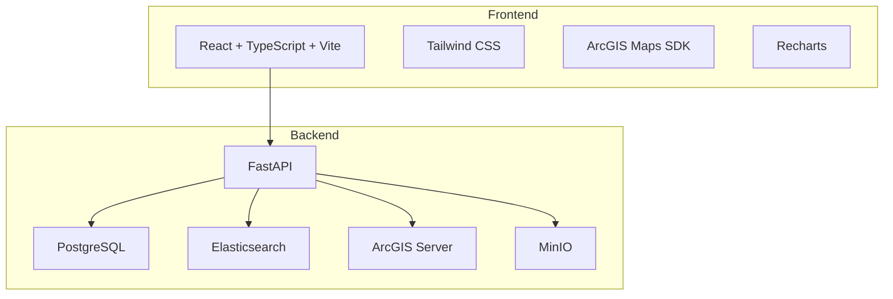
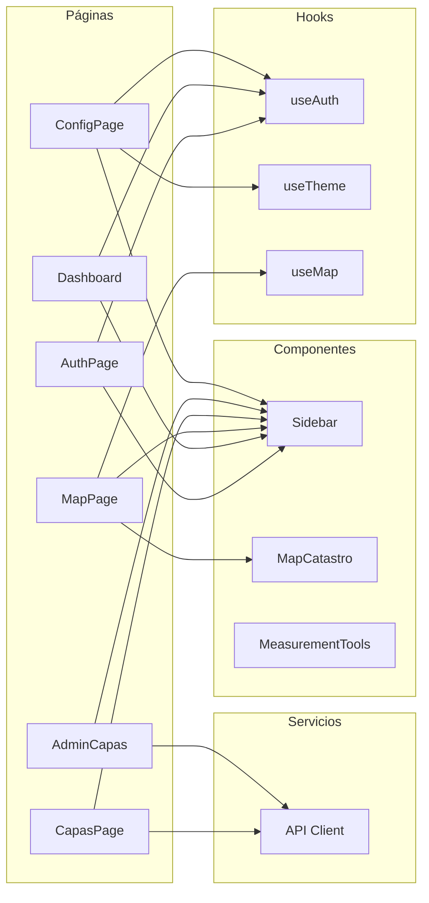
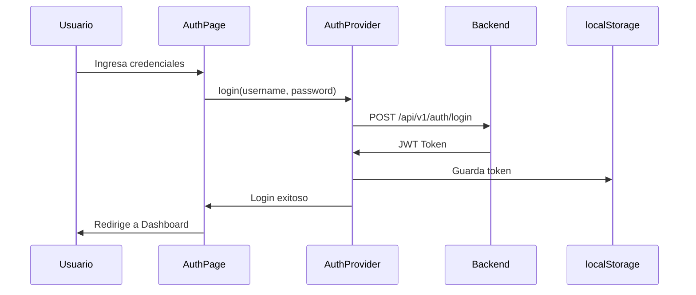
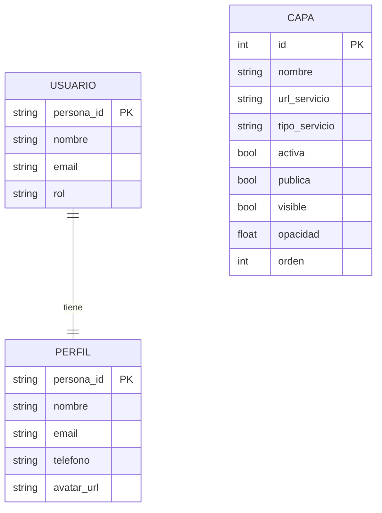
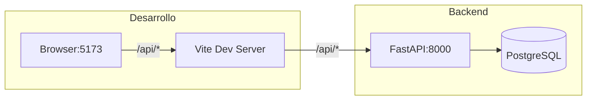
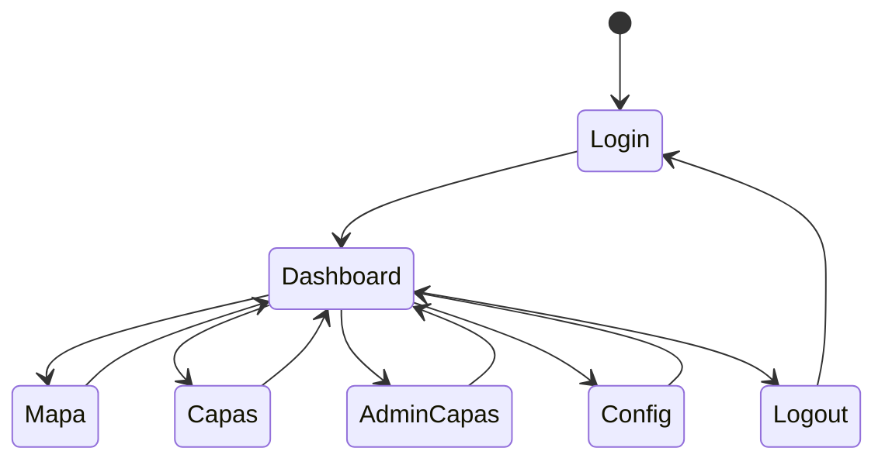

# Arquitectura del Sistema GAMC-IDE

## Visión General

## Arquitectura de Componentes

## Flujo de Autenticación

## Estructura de Datos

## Stack Tecnológico

| Capa | Tecnología |
|------|------------|
| Frontend | React 18, TypeScript, Vite |
| Estilos | Tailwind CSS v4, shadcn/ui |
| Mapas | ArcGIS Maps SDK |
| Gráficos | Recharts |
| HTTP Client | Fetch API |
| Build | Vite |
| Linting | ESLint |

## Configuración de Proxy

## Páginas del Sistema

## Características Principales

### 1. Autenticación
- Login con usuario y contraseña
- Token JWT almacenado en localStorage
- Proxy para evitar CORS

### 2. Dashboard
- Indicadores visuales
- Gráficos de barras y pastel
- Tabla de predios recientes

### 3. Mapa
- Visor ArcGIS
- Capas de predios, manzanas, vías
- Herramientas de medición
- Galería de mapas históricos

### 4. Gestión de Capas
- Vista lista/grilla
- Filtros por estado, tipo
- Paginación configurable
- Copiar URL

### 5. Administración
- Importar capas de ArcGIS
- Editar propiedades
- Gestionar activa/pública/visible
